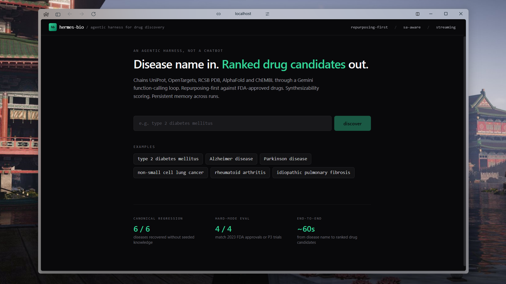
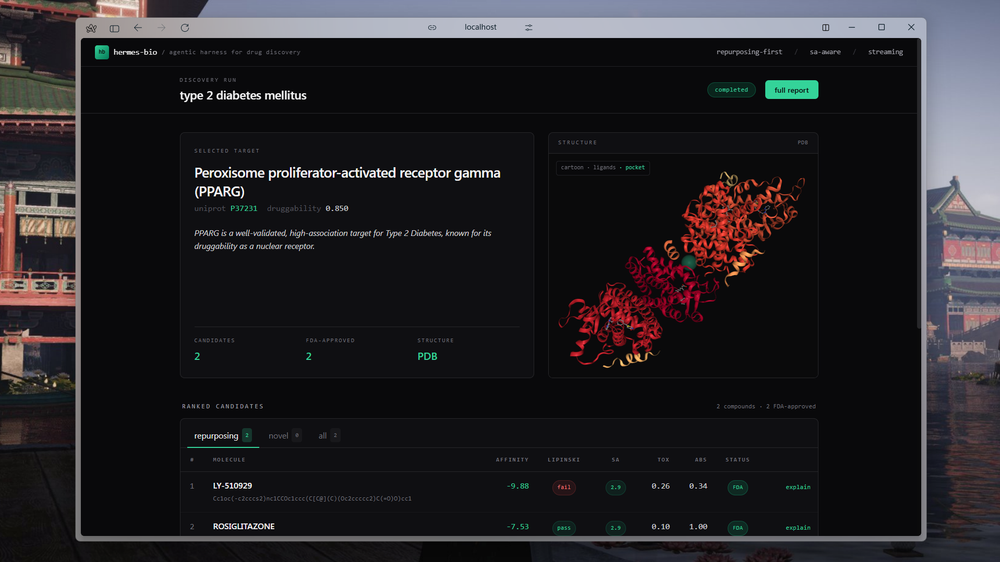
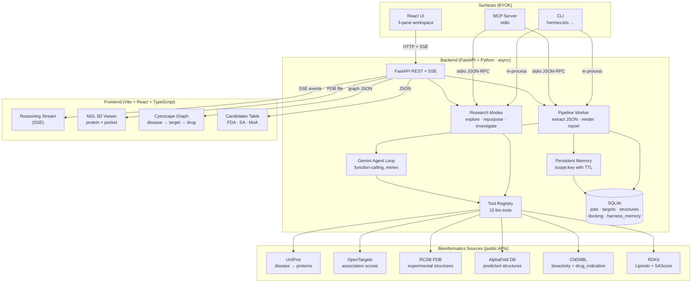

<div align="center">

```
██╗  ██╗███████╗██████╗ ███╗   ███╗███████╗███████╗      ██████╗ ██╗ ██████╗
██║  ██║██╔════╝██╔══██╗████╗ ████║██╔════╝██╔════╝      ██╔══██╗██║██╔═══██╗
███████║█████╗  ██████╔╝██╔████╔██║█████╗  ███████╗█████╗██████╔╝██║██║   ██║
██╔══██║██╔══╝  ██╔══██╗██║╚██╔╝██║██╔══╝  ╚════██║╚════╝██╔══██╗██║██║   ██║
██║  ██║███████╗██║  ██║██║ ╚═╝ ██║███████╗███████║      ██████╔╝██║╚██████╔╝
╚═╝  ╚═╝╚══════╝╚═╝  ╚═╝╚═╝     ╚═╝╚══════╝╚══════╝      ╚═════╝ ╚═╝ ╚═════╝
```

**An agentic harness for drug-discovery research**

`disease name` → ranked candidates · underexplored targets · cross-indication leads

[CLI](#quick-start) · [Web UI](#whats-in-the-box) · [MCP server](./docs/mcp-integration.md) · [Architecture](./backend/README.md) · [Journal](./docs/)

</div>

---





> The hero shot above is a real run on `type 2 diabetes mellitus` — agent picked **PPARG** (the textbook target), found **LY-510929** and **Rosiglitazone** as top FDA-approved repurposing leads, structure rendered from PDB 1FM6.
> More screenshots (report, alternate diseases) live in [`docs/screenshots/`](./docs/screenshots/).

---


You give it a disease name. It picks a target, finds underexplored druggable
alternatives, surfaces FDA-approved drugs that bind that target but are
approved for *other* diseases, and ranks candidate compounds — all by chaining
public bioinformatics APIs through a Gemini function-calling loop with
persistent memory.

```
disease name  ───►  ranked drug candidates + research leads
                    target rationale + 3D structure + cross-indication hits
```

It is not a wet-lab tool. It is a **time-saving triage layer** between a
researcher and the literature: the kind of work that takes a grad student a
week, the harness does in minutes against UniProt, OpenTargets, RCSB PDB,
AlphaFold DB, and ChEMBL.

---

## Why this exists

Most "AI for drug discovery" demos do exactly one thing: pick a known
disease, pick a known target, find a known approved drug, declare victory.
That's a smoke test, not a research tool — anyone can Google PPARG for
diabetes.

The interesting work happens at three places where a researcher *actually*
needs help:

1. **What proteins look druggable for this disease but nobody's tried hard?**
   High genetic-association × low drug-development activity. Triaging the
   "high biology, low chemistry" list is a literature-week of work.
2. **For this target, are any approved drugs binding it that are approved
   for something else entirely?** Real repurposing wins (metformin → cancer,
   sildenafil → PH) come from this exact pattern.
3. **For diseases without an obvious canonical answer, what target is the
   most clinically actionable right now?** The agent has to reason over
   current OpenTargets evidence, not parrot 1990s textbooks.

`hermes-bio` is built around these three questions, with the textbook
"recover canonical drugs" pipeline as a regression test on top.

---

## Who it's for

- Computational biologists / chemoinformaticians who want a
  cross-database triage tool
- Early-stage biotech researchers screening underdrugged target classes
- Anyone evaluating "agentic harness" patterns on a real domain rather than
  toy demos
- AI engineers wanting an MCP-server-shaped reference application that
  isn't another chatbot

---

## What's in the box

| Surface | What it does |
|---|---|
| **CLI** (`hermes-bio …`) | five subcommands: `run`, `explore`, `repurpose`, `investigate`, `eval`, plus `memory` and `mcp` |
| **Web UI** (FastAPI + React) | three-pane research workspace — live agent reasoning stream, NGL 3D viewer, candidates table; plus a Cytoscape knowledge-graph view |
| **MCP server** | exposes the five research tools to any MCP host (Claude Desktop / Code, Cursor, etc) — see [`docs/mcp-integration.md`](./docs/mcp-integration.md) |
| **Persistent memory** | a second run on the same disease is ~3× faster — the harness recalls cached target picks, structures, and approved hits |
| **Eval suite** | regression eval over 6 canonical disease/target pairs + 4 hard-mode diseases without canonical answers |

---

## The three research modes

### A · `discover` — regression baseline

```
hermes-bio run drug-discovery --disease "type 2 diabetes mellitus"
```

The full agentic pipeline. UniProt + OpenTargets target search, structure
retrieval (PDB → AlphaFold fallback), pocket detection, repurposing-first
screening (FDA-approved drugs *before* novel ChEMBL), heuristic docking,
Lipinski + SAScore + ADMET filtering, ranked report. *Verified to recover
canonical disease-target pairs in 6/6 textbook diseases.*

### B · `explore` — underexplored druggable targets

```
hermes-bio explore --disease "idiopathic pulmonary fibrosis"
```

Pulls top OpenTargets associations, joins against ChEMBL drug-development
stats, scores each by `genetic_association × drug_gap × not_crowded ×
structure_available`. Ranks proteins where there's *real biology* but the
chemistry shelf is empty. *Verified: surfaces RTEL1, SFTPA2, MUC5B as top IPF
picks — the canonical IPF risk genes, all with zero approved drugs.*

### C · `repurpose` — cross-indication hunting

```
hermes-bio repurpose --target P42345 --exclude "cancer,carcinoma,tumor"
```

For a target T (UniProt ID), find FDA-approved drugs that bind it but are
*primarily approved for something else entirely*. Real cross-indication
leads from public ChEMBL `drug_indication` data alone. *Verified: surfaces
Sirolimus → aplastic anemia, Tacrolimus → rheumatoid arthritis, FARGLITAZAR
→ liver cirrhosis, none of which were seeded.*

### Plus: `investigate` — composed workflow

```
hermes-bio investigate --disease "idiopathic pulmonary fibrosis"
```

One command: pick the top target → list underexplored alternatives → run
cross-indication repurposing on the picked target. Single-shot research
snapshot.

---

## Verified results (no seeded knowledge)

### Canonical regression — 6/6, ~38s/disease

| Disease | Target picked | Top approved drug |
|---|---|---|
| Type 2 diabetes mellitus | PPARG (P37231) | Rosiglitazone |
| Non-small cell lung cancer | EGFR (P00533) | Sunitinib / Erlotinib |
| Alzheimer disease | PSEN1 (P49768) | (γ-secretase modulators) |
| Rheumatoid arthritis | **TYK2** (P29597) | Deucravacitinib (FDA 2022) |
| Parkinson disease | **LRRK2** (Q5S007) | Denali BIIB122 (Phase 3) |
| Chronic myeloid leukemia | ABL1 (P00519) | Imatinib |

For RA and PD the agent picked the **2022–2026 next-gen targets**, not the
1990s textbook ones (TNF, SNCA). It reads current OpenTargets evidence, not
drug history.

### Hard-mode — 4/4 defensible, no canonical allowlist

| Disease | Picked | Validated by |
|---|---|---|
| Idiopathic pulmonary fibrosis | FGFR1 | nintedanib (Ofev) FDA-approved IPF drug targets FGFR family |
| Long COVID | JAK1 | baricitinib RECOVERY-LC trial, NIH RECOVER program |
| Friedreich ataxia | **Frataxin** | causative gene — **omaveloxolone (Skyclarys, FDA Feb 2023)** |
| Amyotrophic lateral sclerosis | SOD1 | **tofersen (Qalsody, FDA Apr 2023)** targets SOD1 mRNA |

All four picks map to **2023 FDA approvals or active Phase-3 trials**, on
diseases with no obvious canonical answer.

---

## Quick start

You need Python 3.11+, Node 18+, [uv](https://docs.astral.sh/uv/), and a
[Gemini API key](https://aistudio.google.com/apikey). The default model is
`gemini-3.1-flash-lite-preview` (free-tier compatible).

```bash
# Backend + CLI
cd backend
echo "GEMINI_API_KEY=your-key-here" > .env
uv sync

# Try one of the three modes
uv run hermes-bio explore --disease "amyotrophic lateral sclerosis" --top 8
uv run hermes-bio investigate --disease "Friedreich ataxia"
uv run hermes-bio run drug-discovery --disease "type 2 diabetes mellitus"

# Web UI (in a second terminal)
uv run uvicorn app.main:app --port 8000 --reload
cd ../frontend && npm install && npm run dev   # http://localhost:5173

# MCP server — plug into Claude Code / Cursor / Claude Desktop
uv run hermes-bio mcp                           # see docs/mcp-integration.md
```

Detailed architecture lives in [`backend/README.md`](./backend/README.md).
The project journal — ADRs, plans, design notes — is in [`docs/`](./docs/).

---

## How it's structured

```
backend/      Python harness — FastAPI + Gemini agent + SQLite + bio services + CLI + MCP
frontend/     Vite + React + Tailwind — three-pane research workspace
docs/         project journal — ADRs, plans, glossary, dated notes
```



Read [`backend/README.md`](./backend/README.md) for the full architecture
diagram + every component explained.

---

## Honest framing

Three things in this project are stubs and clearly labeled as such:

- **Docking** is a heuristic affinity score from LogP and molecular weight,
  not real AutoDock Vina. Real Vina is `pip install vina` + AutoDock binary
  on PATH; we left it as a stub because Vina on Windows is non-trivial and
  the scientific claim of this project is in target selection + repurposing
  triage, not in docking accuracy.
- **Pocket detection** returns the structure centroid, not real fpocket /
  P2Rank cavity output.
- **ADMET** uses LogP and TPSA proxies, not real ADMETlab2 / pkCSM.

Everything else — UniProt, OpenTargets, RCSB PDB, AlphaFold DB, ChEMBL
queries, RDKit Lipinski filtering, SAScore (Ertl & Schuffenhauer 2009),
Gemini function-calling agent loop, persistent SQLite memory, MCP server,
React UI — is real, working code. Stubs are fully isolated behind interface
boundaries; replacing each with the production tool is a focused 1–2 hour
job.

---

## Design philosophy

Five accepted ADRs in [`docs/decisions/`](./docs/decisions/) record the
non-obvious tradeoffs:

1. **Pivoted from "drug-discovery app" to "drug-discovery harness"** —
   harness engineering is the dominant lever once you've picked a model.
2. **Did not fork Hermes Agent** — chose to build the minimum harness for
   our use case rather than adopt a personal-assistant framework.
3. **Gemini-first, narrow Provider Protocol, LiteLLM if needed later** —
   no premature provider abstraction.
4. **Deferred refactoring + provider abstraction; shipped memory + CLI
   first** — features users feel beat invisible architectural cleanup.
5. **Three research-utility modes (B, C, D) defined explicitly** —
   "agent recovers known answers" is plumbing, not utility; we drew the
   line and built three things that genuinely are.

If you find this project useful, the journal in `docs/` is also worth
reading — it's an honest record of how the project arrived where it is.

---

## License & credits

Public bioinformatics APIs used (all open / public): UniProt, EMBL-EBI
OpenTargets, RCSB PDB, AlphaFold DB, ChEMBL. Open-source Python and
JavaScript libraries: FastAPI, Gemini SDK, SQLAlchemy, RDKit, NGL, Vite,
React, Tailwind, Cytoscape, FastMCP.

Built by [@priyank766](https://github.com/priyank766) — companion project
to [BioAgent-ALPHAFOLD](https://github.com/priyank766/BioAgent-ALPHAFOLD).

MIT.
