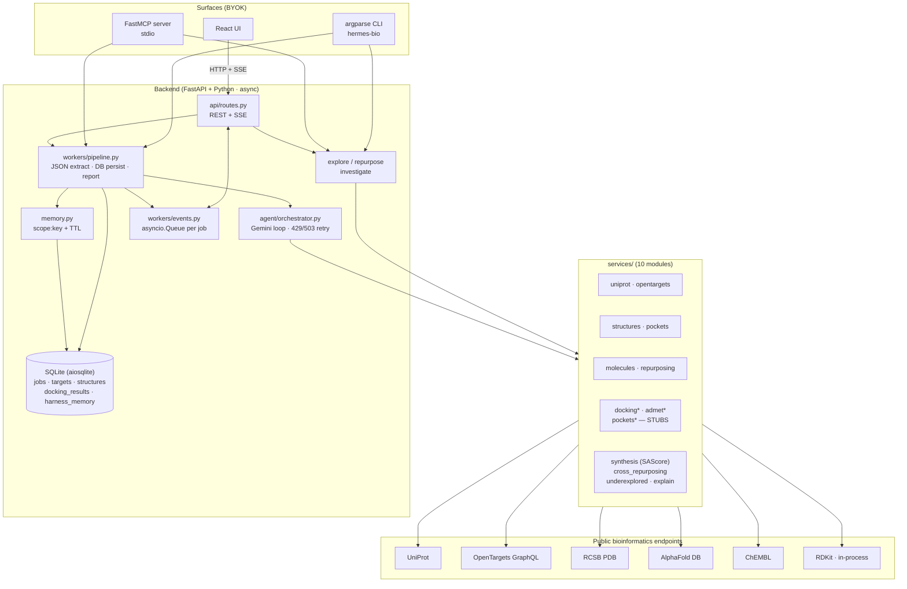

# hermes-bio · backend

The Python harness behind the project — agent loop, tool dispatcher, MCP
server, persistent memory, CLI, REST + SSE API. Frontend (`../frontend/`)
talks to it over HTTP; the CLI and MCP server talk to it directly.

## Stack

| Concern | Choice | Why |
|---|---|---|
| Web framework | FastAPI + Uvicorn | async, OpenAPI for free, plays well with SSE |
| LLM provider | Gemini (`google-genai` SDK) | function-calling, generous free tier, good at structured outputs |
| ORM | SQLAlchemy 2.x async + aiosqlite | simple deployment, no separate DB process |
| Bio APIs | httpx (async) over UniProt / OpenTargets / RCSB / AlphaFold / ChEMBL | all public, no auth |
| Chemistry | RDKit | Lipinski + descriptors + SAScore (via `RDConfig.RDContribDir/SA_Score`) |
| Templating | Jinja2 | HTML report only |
| MCP | FastMCP | thin decorator over the protocol |
| Packaging | uv + hatchling | uv resolves + runs; hatchling builds the entry-point script |

## High-level architecture



### Detail (text)

```
┌─────────────────────────────────────────────────────────────────────┐
│ Surfaces                                                            │
│ ┌─────────────┐  ┌──────────────┐  ┌─────────────┐  ┌────────────┐  │
│ │ FastAPI HTTP│  │ Server-Sent  │  │ argparse CLI │  │ FastMCP    │  │
│ │ /api/...    │  │ Events       │  │ hermes-bio   │  │ (stdio)    │  │
│ └──────┬──────┘  └──────┬───────┘  └──────┬───────┘  └─────┬──────┘  │
│        │                │                 │                │         │
└────────┼────────────────┼─────────────────┼────────────────┼─────────┘
         │                │                 │                │
         ▼                ▼                 ▼                ▼
┌─────────────────────────────────────────────────────────────────────┐
│ Pipeline + Eval entry points                                        │
│   workers/pipeline.run_pipeline(job_id, disease)                    │
│   eval.run_eval(diseases, hard=...)                                 │
└──────────────────────────────────┬──────────────────────────────────┘
                                   │
            ┌──────────────────────┼──────────────────────┐
            ▼                      ▼                      ▼
   ┌─────────────────┐   ┌──────────────────┐   ┌──────────────────┐
   │ memory.recall   │   │ orchestrator     │   │ services/        │
   │ (read cache)    │   │ Gemini loop +    │   │ (direct API for  │
   │                 │   │ tool dispatch    │   │  explore /       │
   │                 │   │ + retries        │   │  repurpose)      │
   └─────────────────┘   └────────┬─────────┘   └──────────────────┘
                                  │
              tool_call           │           tool_result
                                  ▼
              ┌───────────────────────────────────┐
              │ agent/tools.DISPATCH (10 tools)   │
              │  → services/uniprot               │
              │  → services/opentargets           │
              │  → services/structures            │
              │  → services/pockets               │
              │  → services/molecules (RDKit)     │
              │  → services/repurposing           │
              │  → services/synthesis (SAScore)   │
              │  → services/docking (stub)        │
              │  → services/admet (proxy)         │
              └───────────────────────────────────┘
                                  │
                                  ▼
                    structured JSON in agent reply
                                  │
              ┌───────────────────┴───────────────────┐
              ▼                                       ▼
         persist DB rows                       publish to event bus
         Job → Target → Structure              workers/events.py
              → DockingResult                  (in-memory pub/sub)
              + memory.put                            │
                                                      ▼
                                         consumers: SSE endpoint,
                                         CLI streamer
```

## Module map

```
backend/app/
  main.py                    FastAPI entry; CORS, lifespan, mounts api/routes
  config.py                  pydantic-settings — GEMINI_API_KEY, model, paths
  db.py                      SQLAlchemy models; init_db; SessionLocal
  memory.py                  persistent KV — get/put/recall/clear, normalizers, TTLs
  cli.py                     argparse dispatcher — run/explore/repurpose/investigate/eval/memory/mcp
  eval.py                    canonical-targets regression (Mode A) + hard-mode (Mode D)
  mcp_server.py              FastMCP exposing 5 research tools over stdio

  api/routes.py              REST + SSE endpoints

  agent/
    orchestrator.py          Gemini function-calling loop with 429/503 retry,
                             memory_note injection, structured-result event
    prompts.py               drug-discovery system prompt (repurposing-first)
    tools.py                 tool function declarations + DISPATCH dict

  services/
    uniprot.py               disease → human reviewed proteins (UniProt REST)
    opentargets.py           disease → top targets w/ association_score (GraphQL)
    structures.py            UniProt → PDB or AlphaFold .pdb file
    pockets.py               STUB — centroid pocket; replace with fpocket
    molecules.py             ChEMBL bioactivity fetch + RDKit Lipinski
    repurposing.py           ChEMBL approved (max_phase=4) drugs for a target
    synthesis.py             SAScore (Ertl 2009) via RDKit Contrib + heuristic fallback
    docking.py               STUB — heuristic affinity from LogP+MW
    admet.py                 PROXY — LogP/TPSA-derived absorption + toxicity scores
    explain.py               per-candidate Mechanism-of-Action (extra Gemini call)
    reports.py               Jinja2 HTML report
    underexplored.py         Mode B service — score = assoc × drug_gap × not_crowded × actionable
    cross_repurposing.py     Mode C service — ChEMBL drug_indication-based filter

  workers/
    pipeline.py              background runner: drives orchestrator, parses agent JSON,
                             persists rows, writes/reads memory, publishes events,
                             renders HTML report
    events.py                in-memory pub/sub (asyncio.Queue per job_id)

  templates/
    report.html.j2           dark research-theme HTML report
```

## Database schema

SQLite, async via aiosqlite. Auto-created on startup (`init_db`).

```
jobs                   one per /api/discover request
  id (str pk, hex12)   stable URL slug
  disease_input str
  status               pending | running | completed | failed
  current_step int     0..6
  progress int         0..100
  error text
  reasoning_log JSON   list of event dicts (tool_call, tool_result, reasoning, retry)
  created_at, updated_at

targets                1:N from job
  id, job_id fk
  uniprot_id, protein_name
  druggability_score float
  rationale text
  selected bool

structures             1:N from target
  id, target_id fk
  pdb_path str         on-disk relative to DATA_DIR/structures/
  source               PDB | AlphaFold
  quality_score float  pLDDT for AF, null for PDB
  pocket_data JSON     {center: [x,y,z], score, volume, residues}

docking_results        1:N from structure
  id, structure_id fk
  molecule_smiles, molecule_name
  binding_affinity float (kcal/mol)
  rank int
  lipinski_pass bool
  toxicity_score, absorption_score, synthesis_score float
  is_approved_drug bool       repurposing flag
  mechanism_explanation text  lazy MoA cache

harness_memory         persistent KV
  scope str            e.g. "drug_discovery"
  key str               e.g. "disease:type-2-diabetes-mellitus"
  value JSON           free-form
  created_at, expires_at
```

## REST + SSE API

| Method | Path | Purpose |
|---|---|---|
| `POST` | `/api/discover` | start a job — body `{"disease": "..."}` → `{job_id, status}` |
| `GET`  | `/api/jobs/{id}` | status + reasoning_log |
| `GET`  | `/api/jobs/{id}/events` | SSE stream — `data: {type, ...}\n\n` per event |
| `GET`  | `/api/jobs/{id}/candidates` | structured result — target + structure + ranked candidates |
| `GET`  | `/api/jobs/{id}/structure` | the PDB file (chemical/x-pdb) for NGL viewer |
| `GET`  | `/api/jobs/{id}/graph` | Cytoscape JSON — disease → target → structure → drug |
| `POST` | `/api/jobs/{id}/candidates/{rank}/explain` | lazy MoA explanation (Gemini call) |
| `GET`  | `/api/jobs/{id}/report` | HTML report |
| `GET`  | `/api/memory` | recall harness memory `?scope=&prefix=` |
| `DELETE` | `/api/memory` | clear harness memory `?scope=&prefix=` |

## Agent loop in detail

`agent/orchestrator.run_agent(disease, on_event, memory_note)`:

1. Build a Gemini `Client` from `settings.gemini_api_key`.
2. Render system instruction = `SYSTEM_PROMPT` + `<harness-memory>` block if a
   memory note was passed. The memory note is human-readable prose generated
   by `pipeline._build_memory_note` from the cached entry.
3. Initial user message = `"Discover drug candidates for: {disease}"`.
4. Loop up to `MAX_ITERATIONS=25`:
   - Call `client.models.generate_content(...)` with `tools=TOOL_DECLARATIONS`.
   - Retry on `429` / `503` with exponential backoff (max 6 attempts, max
     20s sleep) — emits a `retry` event each attempt.
   - For each part in the response: if `text` → emit `reasoning` event; if
     `function_call` → look up handler in `DISPATCH`, await it, emit
     `tool_call` + `tool_result` events, append the function response to
     `contents` for the next turn.
   - If no function calls returned, the loop exits with `final_text`.
5. Returns `{final_text, tool_calls}`.

The loop is provider-coupled to Gemini today. ADR 0003 records the plan to
introduce a `Provider` Protocol once a second provider is justified.

## Pipeline (the agent's host)

`workers/pipeline.run_pipeline(job_id, disease)`:

1. Mark `Job.status = running`. Publish `status` event.
2. `_build_memory_note(disease)` — read `memory.disease_key(disease)` from
   `harness_memory`. If hit, emit a `memory_recall` event and pass the prose
   to the orchestrator.
3. Run the agent loop. Each event is both persisted to `Job.reasoning_log`
   and published on the bus.
4. Extract structured JSON from `final_text` via `_extract_json_block`
   (matches a `\`\`\`json {…} \`\`\`` fenced block, falls back to the first
   `{…}` that parses).
5. `_persist_structured` — write `Target`, `Structure`, `DockingResult` rows
   from the parsed JSON.
6. `_persist_memory_for(job_id, disease)` — cache target_uniprot + structure
   + top approved hits keyed by normalized disease for the next run.
7. Render the HTML report.
8. Mark `Job.status = completed`, publish `done` event.

On exception: mark `failed`, store `error`, publish `error` event.

## Memory — what's deliberate about it

ADR 0002 explicitly ruled out Hermes-style emergent skill creation. Memory
here is decided by the harness, not the agent:

- **Keys are normalized**: `memory.disease_key("Type 2 Diabetes Mellitus")`
  → `disease:type-2-diabetes-mellitus`.
- **TTLs are class-based**: `TTL_TARGET_PICK = 30d`, `TTL_STRUCTURE = 90d`,
  `TTL_FAILED_LOOKUP = 1h`. Long enough to be useful, short enough to age
  out stale picks.
- **Reads** = pre-loop system-prompt injection only (the agent doesn't have
  a "read memory" tool — that would let the agent decide what's true, which
  is wrong for science).
- **Writes** = pipeline-driven only, after a successful run.

Empirical: a second run on the same disease class is ~3× faster — agent
skips the OpenTargets/UniProt re-discovery step.

## CLI dispatch

`cli.build_parser()` wires subcommands to `cmd_*` handlers. Subcommand →
handler → asyncio entry → service or pipeline.

| Subcommand | Hits LLM? | Latency |
|---|---|---|
| `run drug-discovery --disease ...` | yes (full agent loop) | 30–90s |
| `explore --disease ...` | no (pure API joins) | 5–10s |
| `repurpose --target ...` | no | 10–20s |
| `investigate --disease ...` | no | 15–25s |
| `eval` / `eval --hard` | yes (one full agent run per disease) | 30–60s × N |
| `memory show / clear` | no | <1s |
| `mcp` | no | server lifetime |

`--model <id>` on `run` and `eval` mutates `settings.gemini_model` at
process start before any agent code imports.

## MCP server

`mcp_server.py` registers five `@mcp.tool` functions that mirror the CLI
commands as MCP tools. Stdio transport. Logs to stderr only (per MCP rules
about polluting stdout). See [`../docs/mcp-integration.md`](../docs/mcp-integration.md)
for connection configs (Claude Desktop, Claude Code, Cursor).

## Honest stubs

| File | What's stubbed | Replacement |
|---|---|---|
| `services/docking.py` | heuristic affinity from LogP + MW | `pip install vina` + AutoDock binary on PATH |
| `services/pockets.py` | structure centroid, single fake pocket | `fpocket` CLI or P2Rank invocation |
| `services/admet.py` | LogP and TPSA proxies | ADMETlab2 / pkCSM REST |

These are clearly isolated behind interface boundaries. Replacing each is
a 1–2 hour focused change, not an architectural lift. The rest of the system
— the agent loop, the memory subsystem, the API surface, the MCP server —
is real.

## Run, develop, deploy

```bash
# install
cd backend
cp .env.example .env       # fill GEMINI_API_KEY
uv sync

# dev — agent + UI + reload
uv run uvicorn app.main:app --port 8000 --reload

# CLI
uv run hermes-bio --help

# tests / smoke (hits real Gemini quota)
uv run hermes-bio eval                        # 6 canonical, ~4 min
uv run hermes-bio eval --hard                 # 4 hard-mode, ~3 min

# inspect what's been learned
uv run hermes-bio memory show -v
```

Production deployment is outside the current project scope (see
`docs/decisions/0004-defer-refactor-and-providers.md`).

## File-system layout at runtime

```
backend/
  data/
    pipeline.db           SQLite — jobs, targets, structures, docking, memory
    structures/           one .pdb file per fetched structure
    reports/              one .html report per completed job
```

`DATA_DIR` is configurable via env; defaults to `./data` (relative to where
uvicorn runs).

## Testing strategy

- The eval suite (`app/eval.py`) functions as both a research-utility
  benchmark and a regression test. Add a disease + canonical UniProt to
  `KNOWN_TARGETS` and re-run.
- The deterministic services (Lipinski, SAScore, key normalization) are
  small enough that we don't have unit tests yet — the eval covers the
  composed system, which is where most bugs would be caught.

## Where to start reading the code

If you want to extend a service: `app/services/<name>.py` — each is self-contained.

If you want to understand the agent: `app/agent/orchestrator.py` (loop) +
`app/agent/tools.py` (tool registry) + `app/agent/prompts.py` (instructions).

If you want to add a new CLI command: `app/cli.py` — argparse + a `cmd_*`
handler.

If you want to add a new MCP tool: `app/mcp_server.py` — `@mcp.tool` plus
import-on-call to keep the server boot fast.
